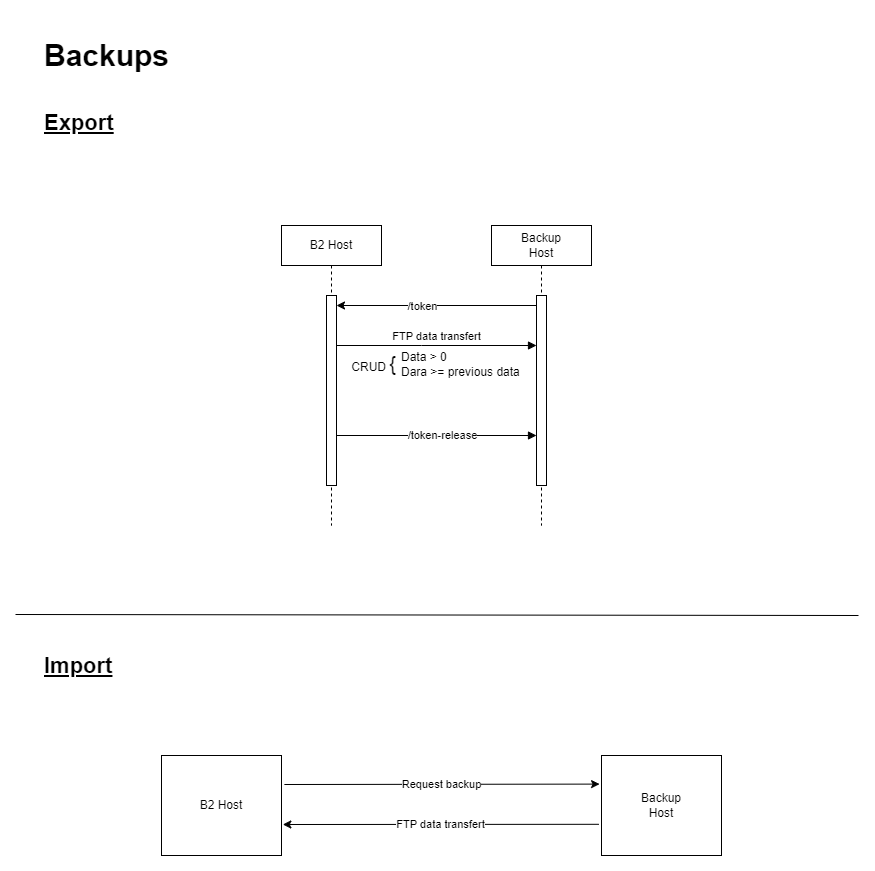
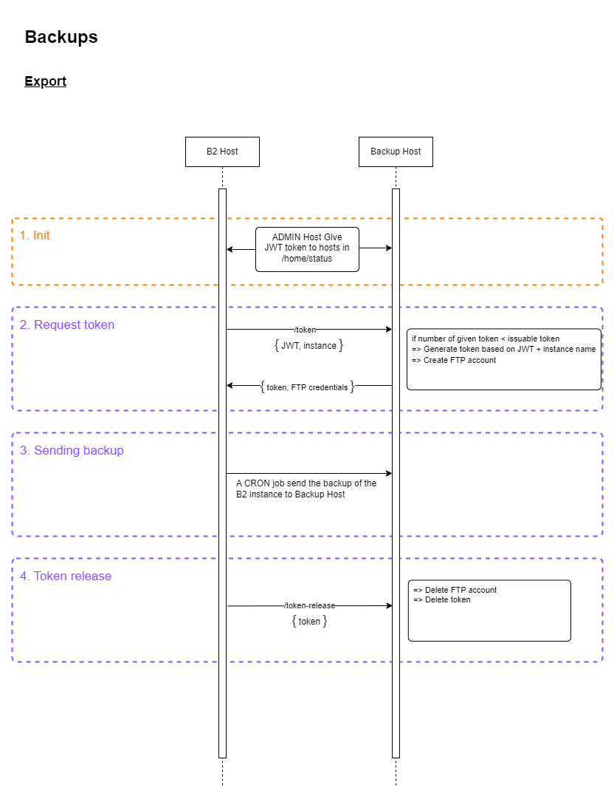
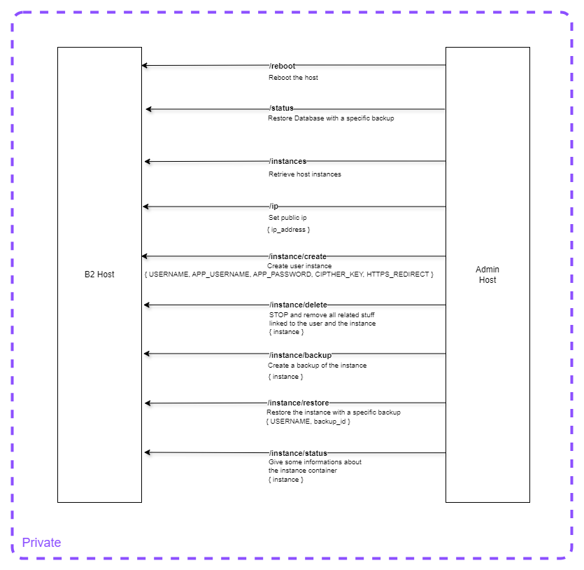
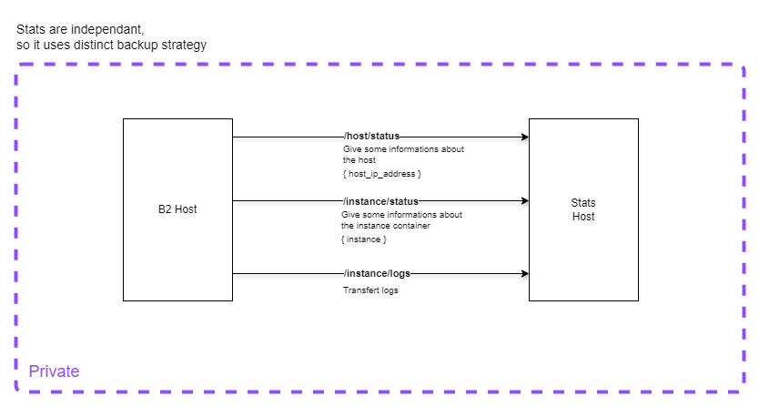
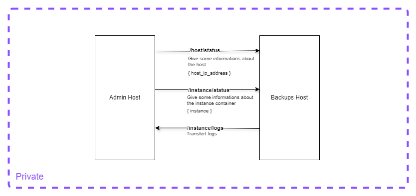

# aru

## Charts

For a better understanding of the system, the following charts provide an overview of the key components and their
interactions:

- **System organization:** Illustrates the high-level organization of the User Instance Management System. 
    

- **Backup and Restore Process:** Outlines the process flow for backing up and restoring user instances. 
    

    

- **Host messages summary:** Summarizes the messages exchanged between the host and the other systems. 
    

    

- **Admin:** Represents the admin interface for managing host backup and host stats. 
    

