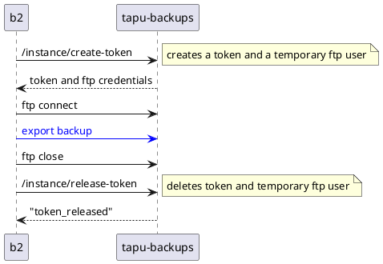
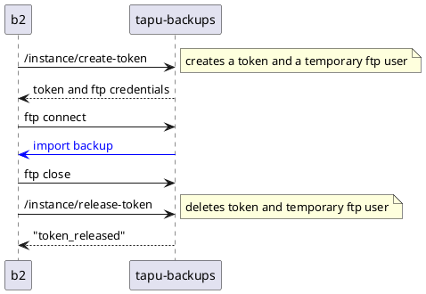

# aru

First things first, arû is a Japanese word that means attic/warehouse. 
This repository is dedicated to the installation scripts, APIs and documentation of special hosts intended to support [b2](https://github.com/yesbabylon/b2) hosts.

Support host types:
  - **tapu-backups** to store instances backups
  - **sapu-stats** to retain log history and track instances statistics
  - **seru-admin** to manage the whole ecosystem of b2, backups and stats hosts

## Important Note

The aru repository must be placed in the `/root` folder of your server.

## Network architecture

Multiple tapu-backups, sapu-stats and b2 hosts are allowed, but there should be only one seru-admin host for management.

The b2 hosts should be the only hosts publicly accessible from the internet. Basically, they expose the eQual instances to the world.

## tapu-backups

A tapu-backups host is meant to store backups of b2 hosts instances for future restoration of state.

### Configuration

The `tapu-backups` host is configured with a `MAX_TOKEN` environment variable.
It defines the maximum number of tokens available, limiting the number of simultaneous backup operations it can handle.

By coordinating token management and connection credentials, the system ensures secure and efficient backups.

### Backup export

A `b2` host can upload an instance backup to a configured `tapu-backups` host using an FTP connection.

#### Workflow

### Backup import

A `b2` host can download an instance backup from a configured `tapu-backups` host using an FTP connection.

#### Workflow

## sapu-stats

IN PROGRESS

## seru-admin

IN PROGRESS
